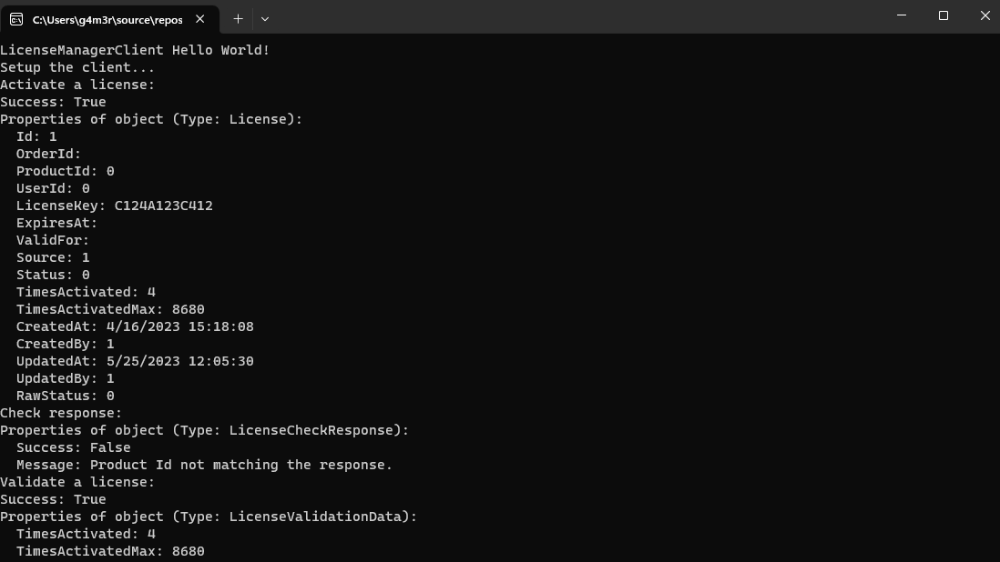
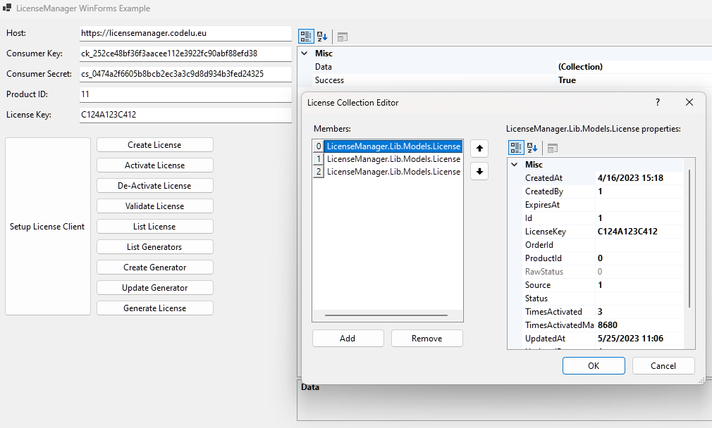
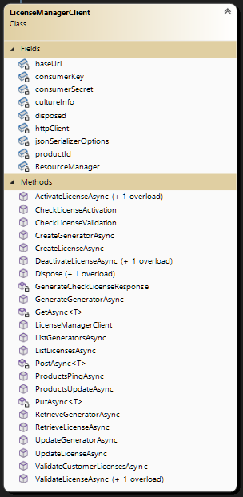

# LicenseManager for WooCommerce .Net Library
[](https://www.nuget.org/packages/LicenseManager)
[](https://www.nuget.org/packages/LicenseManager)

An unofficial C# Library for the [LicenseManager for WooCommerce](https://github.com/wpexpertsio/license-manager-woocommerce) (formerly known as LicenseManager.at). This library makes it easy to activate or validate software licenses from .Net applications.

## Install the package using Nuget
Get the library from [NuGet](https://www.nuget.org/packages/LicenseManager/).
```
PM> NuGet\Install-Package LicenseManager
```

# Examples
## Minimal usage example for License Activation
For more information/details take a look at the example projects.
```c#
// 1. Create a new instance of license manager client

var baseUrl = "https://licensemanager.codelu.eu/";
var consumerKey = "ck_a0625b314db9ab7f44d4c29ac93aab416aa8ef8e";
var consumerSecret = "cs_37abbda659e5932b286546890322d2fd55e9e298";

// Set the culture (language) for the license checking messages
var cultureInfo = new CultureInfo("en");
//var cultureInfo = new CultureInfo("de");
//var cultureInfo = new CultureInfo("es");
//var cultureInfo = new CultureInfo("fr");
//var cultureInfo = new CultureInfo("ru");
//var cultureInfo = new CultureInfo("zh");

var client = new LicenseManagerClient(baseUrl, consumerKey, consumerSecret, productId, cultureInfo);

// 2. Activate a license key (this will increase the TimesActivated counter if successful)
// This can is useful when the license should only be used e.g. on one computer
var licenseKey = "MY-LICENSE-KEY";
LicenseKeyResponse activateLicenseResponse = await client.ActivateLicenseAsync(licenseKey);

// 3. Check the LicenseKeyResponse
// This returns a CheckLicenseResponse object indicating the success or failure of the activation check.
// That response also include the localized message
LicenseCheckResponse checkResponse = client.CheckLicenseActivation(activateLicenseResponse, licenseKey);

if (checkResponse.Success) 
{
  // Our license is activated and passed the check!
  Console.Log(checkResponse.Message);

  // For example: Now track that the software is activated in your program and show/unlock the user interface
  Properties.Settings.Default.Activated = true;
  Properties.Settings.Default.Save();
  ShowMyUI();
} else {
  // Our license could not be activated!
  Console.Log(checkResponse.Message);
  return;
}
```

## Minimal usage example for License Validation
For more information/details take a look at the example projects.
```c#
// 1. Create a new instance of license manager client

var baseUrl = "https://licensemanager.codelu.eu/";
var consumerKey = "ck_a0625b314db9ab7f44d4c29ac93aab416aa8ef8e";
var consumerSecret = "cs_37abbda659e5932b286546890322d2fd55e9e298";

// Set the culture (language) for the license checking messages
var cultureInfo = new CultureInfo("en");
//var cultureInfo = new CultureInfo("de");
//var cultureInfo = new CultureInfo("es");
//var cultureInfo = new CultureInfo("fr");
//var cultureInfo = new CultureInfo("ru");
//var cultureInfo = new CultureInfo("zh");

var client = new LicenseManagerClient(baseUrl, consumerKey, consumerSecret, productId, cultureInfo);

// 2. We have previously activated our license for this product / computer
// In the activation example we stored that information inside Properties.Settings.Default.Activated.
// So we could for example check if the product is activated using that information.
if (!Properties.Settings.Default.Activated) 
{
  Console.Log("This product is not activated yet! Please activate it first!");
  return;
}

// 3. Validate the license
var licenseKey = "MY-LICENSE-KEY";
LicenseValidationResponse licenseResponse = await client.ValidateLicenseAsync(licenseKey);

// 4. Check if the validation was successful
// This returns a CheckLicenseResponse object indicating the success or failure of the activation check.
// That response also include the localized message
LicenseCheckResponse checkResponse = client.CheckLicenseValidation(licenseResponse, licenseKey);

if (checkResponse.Success) 
{
  // Our license has passed the check!
  Console.Log(checkResponse.Message);

  // For example: Now show/unlock the user interface
  ShowMyUI();
} else {
  // Our license could not be validated!
  Console.Log(checkResponse.Message);
  return;
}
```

## Console Example
The project also contains a console application project which shows how to use every library function.


## WinForms Example
The project also contains a WinForms GUI project which shows and visualizes the basic functionality.


# Overview
## The library includes the following functionality
- Activate License (with License object as parameter)
- Activate License (with license key as a string parameter)
- Check License Activation
- Check License Validation
- Create Generator
- Create License
- Deactivate License (with License object as parameter)
- Deactivate License (with license key as a string parameter)
- Generate Generator*
- List Generators
- List Licenses
- Ping Products*
- Update Products*
- Retrieve Generator
- Retrieve License
- Update Generator
- Update License
- Validate Customer's Licenses*
- Validate License (with License object as parameter)
- Validate License (with license key as a string parameter)

*It seems like these API endpoints are only available with the newly introduced pro version of the WordPress plugin.



## Contributors
<a href="https://github.com/g4m3r0/LicenseManager-for-WooCommerce-.Net-Library/graphs/contributors">
  
</a>

Made with [contrib.rocks](https://contrib.rocks).
